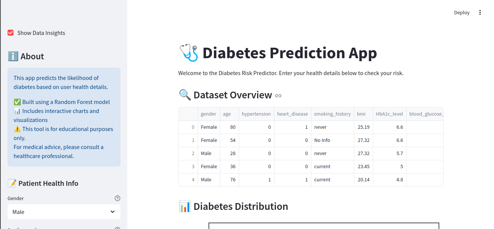
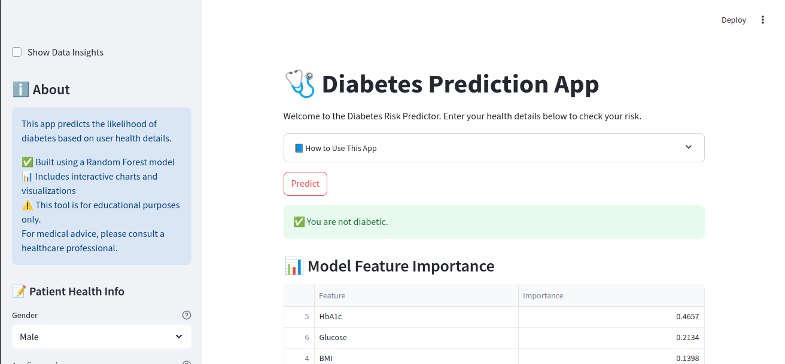

# 🩺 Diabetes Prediction Web App

## 🔗 Live Demo
👉 [Click here to try the app](https://diabetes-prediction-app-production-8e65.up.railway.app/)

---

## Project Overview
This project is a machine learning-based web application that predicts the risk of diabetes using health-related input features. Built using Random Forest Classifier and deployed with Streamlit.

---

## 🚀 Features
- Predict diabetes based on medical inputs
- Built using Random Forest Classifier
- User-friendly UI with Streamlit
- Hosted for public use via the Railway

---

## 📊 Input Fields
- Gender
- Age
- Hypertension
- Heart Disease
- Smoking History
- BMI
- HbA1c Level
- Blood Glucose Level

---

## 📦 Tech Stack
- Python
- Pandas, NumPy, Scikit-learn
- Streamlit
- Railway (for deployment)

---

## 🔗 Live Demo
👉 [Click here to try the app](https://diabetes-prediction-app-production-8e65.up.railway.app/)

---

## 📁 Project Structure
project/
│
├── app/
│ ├── app.py
│ ├── templates/
│ └── static/
├── model/
│ └── diabetes_model.pkl
├── notebook/
│ └── diabetes_prediction.ipynb
├── requirements.txt
├── render.yaml
├── README.md
└── small_diabetes_data.csv

## 🔍 Screenshots

### Homepage

### Prediction Result

## 🧠 Algorithm Used
- Random Forest Classifier with 90%+ accuracy on test data.

## 🙋‍♀️ Author
**Pavani Karanam**  
[GitHub](https://github.com/pavanikaranam-sys)

## 📝 License
This project is open-source and free to use.
